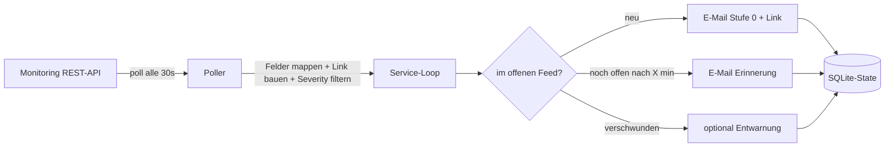

# Incident-Notifier

Ein schlanker Hintergrunddienst für Ubuntu, der die REST-API einer Monitoring-Software
pollt und neue Incidents per **E-Mail** an die Laborleitung schickt — **mit Direktlink zum
Incident**, damit dort quittiert werden kann. Optional zeitbasierte Erinnerung, solange ein
Vorfall offen bleibt. WhatsApp ist als zusätzlicher Kanal vorbereitet (Code liegt bei).

## Konzept

Die **Quittierung passiert in der Monitoring-Software**, nicht im Dienst. Der Notifier
verschickt nur die Benachrichtigung mit Link. Sobald ein Vorfall im Tool quittiert oder
geschlossen ist, verschwindet er aus dem offenen API-Feed → der Dienst stoppt automatisch
weitere Erinnerungen (und schickt optional eine kurze Entwarnung). Es gibt bewusst **keine**
eigene Quittierungs-Erkennung, kein Status-Parsing, keinen Reply-Reader.



Der State (SQLite) verhindert Doppel-Benachrichtigungen über Neustarts hinweg und merkt
sich, welche Erinnerungsstufe zuletzt gesendet wurde.

## Der Link zum Incident

Zwei Wege, in `config.yaml` unter `poll`:

- **Aus einem API-Feld:** `response.fields.url: "permalink"` (falls die API einen Link liefert).
- **Als Vorlage:** `incident_url_template: "https://monitoring.local/incidents/{id}"` —
  `{id}` wird durch die Incident-ID ersetzt.

Der Link landet in der E-Mail („Zum Quittieren öffnen: …").

## Eskalation (rein zeitbasiert)

Unter `escalation.stages` definierst du pro Severity Stufen. `after_minutes` ist die Wartezeit
seit der vorigen Stufe, *sofern der Vorfall noch im offenen Feed steht*. Beispiel: sofort eine
Mail, nach 15 Min eine Erinnerung, falls noch nicht quittiert. Später lässt sich eine spätere
Stufe einfach auf einen WhatsApp-Kanal legen.

## Installation (Ubuntu)

```bash
sudo useradd --system --home /opt/incident-notifier --shell /usr/sbin/nologin incident-notifier
sudo mkdir -p /opt/incident-notifier /etc/incident-notifier
sudo cp -r notifier run.py requirements.txt /opt/incident-notifier/

sudo python3 -m venv /opt/incident-notifier/venv
sudo /opt/incident-notifier/venv/bin/pip install -r /opt/incident-notifier/requirements.txt

sudo cp config.example.yaml /etc/incident-notifier/config.yaml
sudo cp secrets.env.example /etc/incident-notifier/secrets.env
sudo chmod 600 /etc/incident-notifier/secrets.env
sudo chown -R incident-notifier:incident-notifier /opt/incident-notifier /etc/incident-notifier

sudo cp incident-notifier.service /etc/systemd/system/
sudo systemctl daemon-reload
sudo systemctl enable --now incident-notifier
journalctl -u incident-notifier -f
```

Für den E-Mail-only-Start brauchst du `twilio` aus den requirements **nicht** (auskommentiert lassen).

## Anpassung an deine Monitoring-API

Der einzige Pflicht-Eingriff ist `poll.response` in der `config.yaml`: `items_path` zeigt auf
das Array der Incidents, unter `fields` ordnest du die API-Felder zu. Kein Code nötig.

Test ohne systemd:

```bash
INCIDENT_NOTIFIER_CONFIG=./config.yaml python run.py
```

## WhatsApp später hinzufügen

Der Code für WhatsApp liegt bereits bei (`whatsapp_twilio`, `whatsapp_meta`). Wichtig, falls
ihr das aktiviert: WhatsApp erlaubt vom System initiierte Nachrichten nur über einen Anbieter
(Twilio oder Meta Cloud API) und außerhalb eines 24-h-Fensters nur als **vorab freigegebenes
Template**, nicht als Freitext. Eine einfachere Alternative wäre Telegram (kostenlose Bot-API
ohne Template-Zwang) — bei Bedarf ergänze ich einen Telegram-Kanal.

## Sicherheit

- Secrets nur in `secrets.env` (chmod 600), nie in der YAML oder im Git.
- Interne TLS-CA über `verify_tls: "/pfad/zur/ca.pem"` statt `verify_tls: false`.
- Der systemd-Unit ist gehärtet (`ProtectSystem`, `NoNewPrivileges` usw.).

## Erweiterbar

Neuer Kanal: Klasse von `Channel` ableiten, `send(inc, kind)` implementieren, in
`notifier/channels/__init__.py` registrieren (Telegram, Teams, Slack, SMS …).
